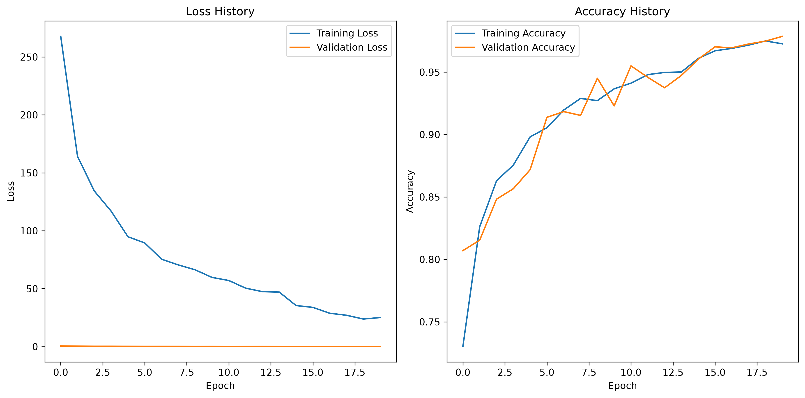
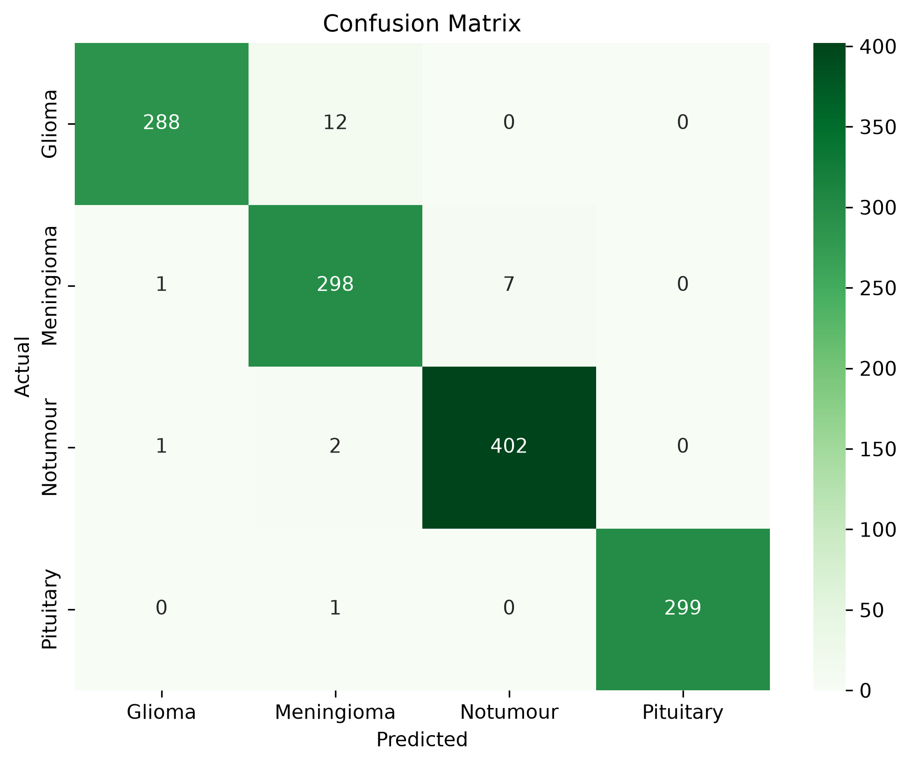

# Brain Tumour Classification Using Convolutional Neural Networks
This project develops a deep learning model to classify brain MRI images into four categories: Glioma, Meningioma, Pituitary Tumour, and No Tumour. The project explores the application of deep learning techniques to medical image classification, evaluating their effectiveness in distinguishing between different tumour types and healthy brain scans. 

The model was implemented using Python and PyTorch, trained on a publicly available MRI dataset consisting of 7023 images, split into 5712 training images and 1311 testing images. Performance metrics such as accuracy, precision, recall, F1-score, and a confusion matrix, were used the evaluate the model.

The final model achieved 98% test accuracy, demonstrating the potential of convolutional neural networks for medical image classification. Despite the strong results, further evaluation using larger and more diverse datasets would be required before considering real-world clinical applications. 

## Notebook

The complete implementation can be found in the Jupyter Notebook:
[Brain Tumour Classification Notebook](Notebook/CNN_brain_tumour_diagnosis.ipynb)

## Methodology

- Data loading and preprocessing
- Exploratory analysis of the training dataset
- Construction of the CNN architecture
- Model training and validation
- Performance evaluation using metrics
- Analysis of strengths, limitations, and potential improvements

## Dataset

The model was trained on a publicly available brain MRI dataset containing 7023 images across four classes:

- Glioma
- Meningioma
- Pituitary Tumour
- No Tumour

The dataset has been split into:
- Training set: 5712 images
- Testing set: 1311 images

## Key Results

| Metric | Score |
|---|---:|
| Accuracy | 99% |
| Precision | 98% |
| Recall | 98% |
| F1-score | 97% |

## Technologies Used

- Python
- PyTorch
- NumPy
- Matplotlib
- Scikit-Learn
- Seaborn
- Pandas
- Jupyter Notebook

## Model Training

The CNN was trained over 20 epochs using the Adam optimiser and Cross Entropy Loss. Training performance improved throughout the process, with the model learning increasingly effective features from the MRI images.

### Training Progress

**Initial Epoch**

- Training Loss: 250.1379
- Training Accuracy: 74.37%
- Validation Loss: 0.4336
- Validation Accuracy: 82.30%

**Final Epoch**

- Training Loss: 2.8574
- Training Accuracy: 99.77%
- Validation Loss: 0.0793
- Validation Accuracy: 98.09%

Training loss decreased substantially throughout training, indicating that the model successfully learned increasingly discriminative image features.

## Results

### Loss and Accuracy Curves

### Confusion Matrix (Testing Data)

## Limitations

- The dataset contains some class imbalance, which may affect model performance.
- High accuracy on a public dataset does not necessarily translate directly to clinical performance.
- Further validation on larger clinical datasets would be required.

## Future Improvements

- Using techniques such as data augmentation or resampling to address the presence of an imbalance within the data
- Conduct further research that focuses on expanding the dataset to a wider range of tumour types
- Implementing transfer learning approaches using pretrained CNN architectures (such as ResNet or EfficientNet) to improve feature extraction and potentially reduce training time.

## Skills Demonstrated

- Deep Learning
- Convolutional Neural Networks (CNNs)
- Image Classification
- Python Programming
- PyTorch
- Data Preprocessing
- Model Evaluation
- Data Visualisation
- Machine Learning Workflow
